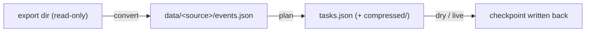

# any2bsky

> **NOTE**: currently most of the codebase is AI generated!!

Migrate your social-media history to Bluesky from any export format:



A datasource only turns its export directory into the generic event stream
(`shared.event`); planning, posting and rollback are shared by all sources.

## Install

```bash
uv sync     # or: pip install -e .
```

Requires `ffmpeg` / `ffprobe`.

## Quick start

```bash
python cli.py login                          # cache session in data/session.json
python cli.py convert qzone <export-dir>     # -> data/<src>/events.json
python cli.py filter <export-dir>            # optional browser keep/drop editor
python cli.py plan <export-dir>              # -> tasks.json (+ compressed/)
python cli.py dry <export-dir> --heavy 3     # preview
python cli.py live <export-dir> --heavy 2    # real posting
```

## CLI

| Command | Description |
|---|---|
| `sources` | list registered datasources |
| `login [--handle H] [--password P] [--session F]` | interactive login + session cache |
| `convert <source> <root>` | datasource → `data/<source>/events.json` (qzone/wechat/telegram) |
| `filter <root> [--port P]` | local browser editor: keep/drop events |
| `plan <root>` | filtered events → `tasks.json` (+ `compressed/`) |
| `dry <root> [--heavy N]` | dry-run the executor on a `tasks.dry.json` copy |
| `undo <root> [--dry] [--yes] [--session F]` | delete published posts (child-first) |
| `live <root> [--heavy N] [--session F]` | real posting |

`--heavy N` limits concurrency for media tasks. All artifacts live in
`./data` (gitignored); the source export is never written to.

## Output

```
data/
├── session.json
└── <source-name>/
    ├── events.json      # generic event stream (v1)
    ├── tasks.json       # task array + resume checkpoint
    ├── tasks.dry.json
    └── compressed/      # AVIF outputs
```

`tasks.json` is a flat `{"tasks": [...]}` array; each task carries
`text/medias(alts)/reply_to/link_url/created_at/state/post_uri/post_cid/parent_uri`.
It is rewritten after every task, so an interrupted run resumes from the first
pending task.

Posts keep their original `createdAt`; Bluesky's thread view then marks them
as "Archived from &lt;original date&gt;".

## Datasources

| Source | Export | Export tool |
|---|---|---|
| `qzone` | `QQ空间备份_<qq>/` tree | [ShunCai/QZoneExport](https://github.com/ShunCai/QZoneExport) |
| `wechat` | JSON with a top-level `posts` array + `media/` | [Panther114/Weport](https://github.com/Panther114/Weport) |
| `telegram` | `messages.json` + `attachments/` | [popstas/telegram-download-chat](https://github.com/popstas/telegram-download-chat) |

Per-source format details: `datasource/*.md`.

## Adding a datasource

```python
# datasource/sources/my_source.py
from datasource.base import BaseDataSource


class MySource(BaseDataSource):
    source_type = "my_source"

    def build_events(self, root):
        return events
```

Register it in `datasource/__init__.py`; every command works unchanged.

## Project structure

```
cli.py
datasource/
  base.py, __init__.py
  sources/{qzone,wechat,telegram}.py
  {qzone,wechat,telegram}.md
shared/
  event.py planner.py executor.py undoer.py auth.py filter_server.py paths.py
tools/editor.html
```

## Dependencies

Python ≥ 3.14, `atproto`, system `ffmpeg` / `ffprobe`; dev: `ruff`.
